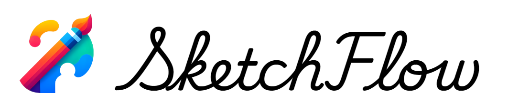
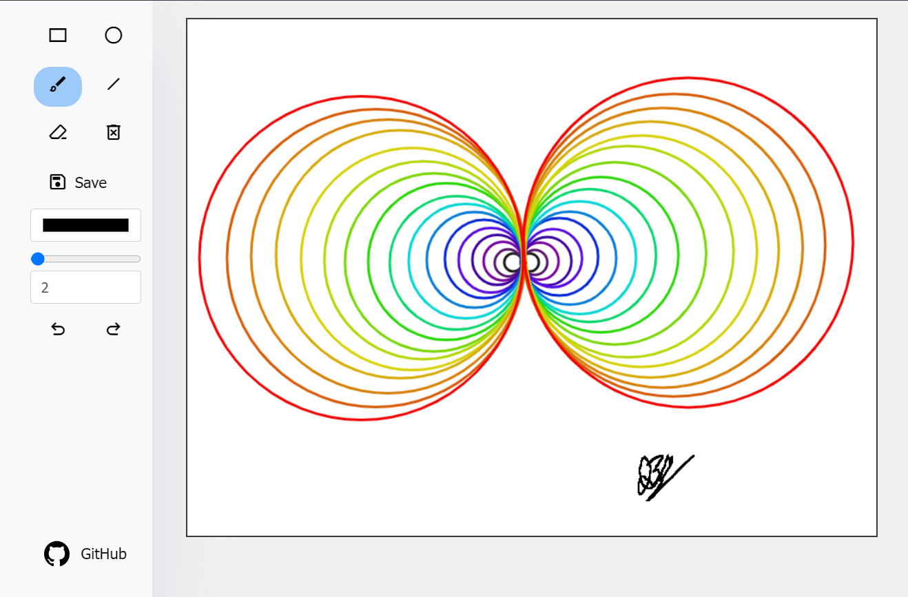
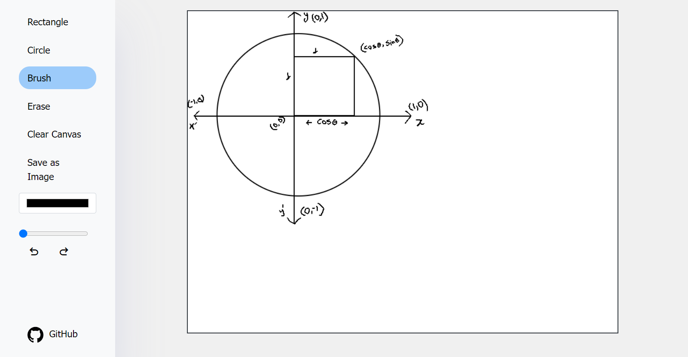
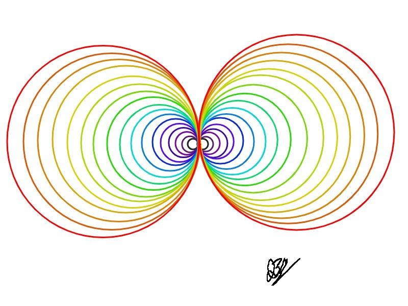

# SketchFlow 🎨
[![Apache 2.0 License][license-shield]][license-url]
[![LinkedIn][linkedin-shield]][linkedin-url]

SketchFlow is a simple web application that allows users to create and draw shapes on a canvas using various drawing tools. This README provides an overview of the SketchFlow project, its features, and how to set it up and use it.



## Features ✨

- **Drawing Tools**: SketchFlow provides four drawing tools:
  - Brush 🖌️: Allows freehand drawing with adjustable brush size.
  - Rectangle ▭: Draws rectangles on the canvas.
  - Circle ⚪: Draws circles on the canvas.
  - Line 📏: Draws straight lines.
  - Erase 🧼: Erases parts of the canvas.

- **Adjustable Brush Size**: Users can adjust the brush size using a range input slider.

- **Color Picker 🎨**: Users can select the drawing color using a color picker input.

- **Save and Clear**: SketchFlow allows users to save their drawings as images and clear the canvas.

- **Undo and Redo**: Users can undo and redo their drawing actions using keyboard shortcuts (Ctrl+Z for undo and Ctrl+Y for redo) or buttons provided in the UI.

- **Responsive Design**: The application is responsive and adapts to different screen sizes, including mobile devices.

## UI



## Save As Image 📸


## Getting Started 🚀

To run SketchFlow locally or contribute to the project, follow these steps:

1. **Clone the repository**:

```bash
git clone https://github.com/iam-baivab/SketchFlow.git
```

2. **Open the project directory**:

```bash
cd SketchFlow
```

3. **Open the** `index.html` **file in your web browser to launch SketchFlow**.

## Technologies Used 💻

- HTML5
- CSS3 (Bootstrap for styling)
- JavaScript (Canvas API for drawing functionality)
- Font Awesome for icons

## Contributing 🤝

Contributions to SketchFlow are welcome! To contribute, follow these steps:

1. Fork the repository.
2. Create a new branch (`git checkout -b feature/my-feature`).
3. Make your changes and commit them (`git commit -am 'Add new feature'`).
4. Push to the branch (`git push origin feature/my-feature`).
5. Create a new Pull Request.

## License 📝

This project is licensed under the Apache-2.0 License. See the [LICENSE](LICENSE) file for details.

## Contact 📧

For any questions or feedback regarding SketchFlow, please open an issue on the GitHub repository or contact the project maintainer [here](https://github.com/iam-baivab).

---

Enjoy drawing and creating with SketchFlow! 🎉

[license-shield]: https://img.shields.io/badge/License-Apache%202.0-red.svg
[license-url]: https://github.com/iam-baivab/SketchFlow/blob/main/LICENSE
[linkedin-shield]: https://img.shields.io/badge/-LinkedIn-black.svg?style=flat&logo=linkedin&colorB=blue
[linkedin-url]: https://www.linkedin.com/in/baivabsarkar/