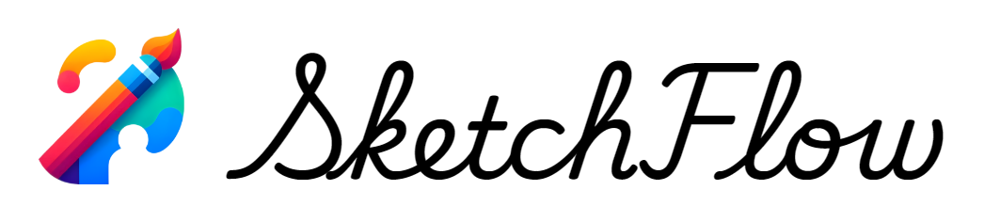

# SketchFlow 🎨
[![Apache 2.0 License][license-shield]][license-url]
[![LinkedIn][linkedin-shield]][linkedin-url]

SketchFlow is a professional, feature-rich sketch drawing application inspired by Excalidraw. Create beautiful diagrams, sketches, and drawings with an intuitive interface and powerful tools designed for both professionals and casual users.



## Features ✨

### 🛠️ Professional Drawing Tools
- **Selection Tool (V)**: Select, move, and manipulate existing elements
- **Hand Tool (H)**: Pan around the canvas for easy navigation
- **Rectangle (R)**: Draw perfect rectangles with customizable properties
- **Circle (C)**: Create circular shapes with precision
- **Diamond (D)**: Draw diamond shapes for flowcharts and diagrams
- **Ellipse (E)**: Create elliptical shapes
- **Arrow (A)**: Draw arrows with automatic arrowheads for diagrams
- **Line (L)**: Draw straight lines between points
- **Pen/Brush (P)**: Freehand drawing with smooth curves
- **Text Tool (T)**: Add text annotations to your drawings
- **Eraser**: Remove unwanted elements

### 🎨 Advanced Styling Options
- **Stroke Color**: Choose from preset colors or use custom colors
- **Fill Color**: Multiple fill options including transparent, solid, and hatch patterns
- **Stroke Width**: Four preset widths (Thin, Regular, Bold, Extra Bold)
- **Stroke Style**: Solid, dashed, or dotted lines
- **Sloppiness Control**: Adjust from architect-precise to hand-drawn cartoonist style
- **Opacity Control**: Fine-tune transparency for all elements

### 🔍 Canvas Controls
- **Zoom In/Out (+/-)**: Scale your canvas for detailed work
- **Reset Zoom (0)**: Return to 100% view instantly
- **Fit to Screen**: Optimize canvas view
- **Grid Background**: Visual guide for alignment

### 💾 Export & Sharing
- **Export as PNG**: High-quality image export with white background
- **Export as SVG**: Vector graphics for scalability (coming soon)
- **Export as JSON**: Save and reload your work
- **Copy to Clipboard**: Quick sharing with one click

### ⌨️ Keyboard Shortcuts
- **Tool Selection**: Single-key shortcuts (V, H, R, C, D, E, A, L, P, T)
- **Actions**: Standard shortcuts (Ctrl+Z/Y for Undo/Redo, Ctrl+C/V for Copy/Paste, Ctrl+D for Duplicate)
- **Delete**: Remove selected elements with Delete or Backspace
- **Select All**: Ctrl+A to select all elements
- **View**: +/- for zoom, 0 to reset

### 🌓 Dark Mode
- Toggle between light and dark themes for comfortable drawing in any environment

### 📱 Responsive Design
- Fully responsive interface that works seamlessly on desktop, tablet, and mobile devices
- Touch-optimized controls for mobile drawing


## Screenshots 📸

### Main Interface
Professional toolbar with all drawing tools and comprehensive property controls.

### Dark Mode
Comfortable drawing experience in low-light environments.

### Keyboard Shortcuts
Quick access to all features with intuitive keyboard shortcuts.

## Getting Started 🚀

To run SketchFlow locally or contribute to the project, follow these steps:

1. **Clone the repository**:

```bash
git clone https://github.com/ThisIs-Developer/SketchFlow.git
```

2. **Open the project directory**:

```bash
cd SketchFlow
```

3. **Open the** `index.html` **file in your web browser to launch SketchFlow**.

## Technologies Used 💻

- **HTML5**: Semantic markup and Canvas API
- **CSS3**: Modern styling with CSS Variables for theming
- **JavaScript (ES6+)**: Vanilla JavaScript with Canvas API for drawing functionality
- **Responsive Design**: Mobile-first approach with media queries
- **Material Icons**: Professional icon set

## Contributing 🤝

Contributions to SketchFlow are welcome! To contribute, follow these steps:

1. Fork the repository.
2. Create a new branch (`git checkout -b feature/my-feature`).
3. Make your changes and commit them (`git commit -am 'Add new feature'`).
4. Push to the branch (`git push origin feature/my-feature`).
5. Create a new Pull Request.

## License 📝

This project is licensed under the Apache-2.0 License. See the [LICENSE](LICENSE) file for details.

## Contact 📧

For any questions or feedback regarding SketchFlow, please open an issue on the GitHub repository or contact the project maintainer [here](https://github.com/ThisIs-Developer).

---

Enjoy drawing and creating with SketchFlow! 🎉

[license-shield]: https://img.shields.io/badge/License-Apache%202.0-red.svg
[license-url]: https://github.com/ThisIs-Developer/SketchFlow/blob/main/LICENSE
[linkedin-shield]: https://img.shields.io/badge/-LinkedIn-black.svg?style=flat&logo=linkedin&colorB=blue
[linkedin-url]: https://www.linkedin.com/in/baivabsarkar/